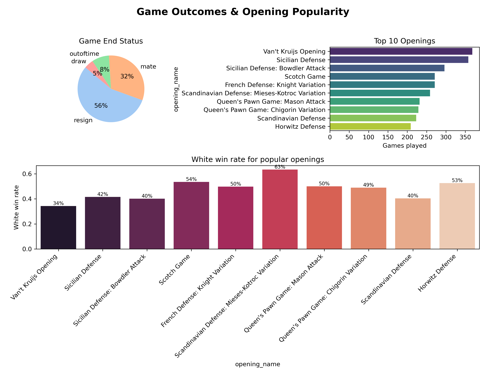

# ♟️ Chess Analysis Project

Welcome to the **Chess Analysis Project** by [Gyanankur23](https://github.com/Gyanankur23)! This repository transforms raw chess game data into strategic insights using Python, Matplotlib, Seaborn, and thoughtful design. Whether you're a player, coach, or data enthusiast, this dashboard reveals patterns that can sharpen your game and mindset.

---

## 📁 Repository Structure

```bash
Chess-Analysis-Project/
├── chess.py                  # Main analysis script
├── Chess Analysis Dashboard.pdf
├── Chess Dashboard Report Summary Analysis.pdf
├── README.md
├── images/
│   ├── report_page1.png
│   ├── report_page2.png
│   └── report_page3.png
```
---

## 📊 Dashboard Overview

The dashboard is split into **three infographic-style pages**, each targeting a unique dimension of chess gameplay:

### 🧠 Page 1: Player Performance & Ratings
- **Rating Distribution**: Overlay of white and black player ratings with KDE curves.
- **White Win Rate by Rating Bucket**: Reveals how rating tiers influence outcomes.
- **Top 10 Most Active Players (White)**: Frequency and performance of top white players.


---

### 🧩 Page 2: Game Outcomes & Opening Popularity
- **Game End Status**: Pie chart of outcomes (mate, resign, draw, timeout).
- **Top 10 Openings**: Most played openings across games.
- **White Win Rate by Opening**: Strategic effectiveness of each opening.



---

### ⏱️ Page 3: Impact of Time Controls
- **Game Length by Time Category**: Boxplot of turns across Bullet, Blitz, Rapid, Classical.
- **White Win Rate by Time Control**: Performance trends across formats.
- **Outlier Game Lengths**: Distribution of very short and very long games.


---

## 🧵 Key Insights from Analysis

- **White Advantage**: White players show higher win rates in mid-to-high rating buckets.
- **Opening Strategy**: Scotch Game and Bowdler Attack yield strong white performance.
- **Time Control Impact**: Classical games favor deeper strategy and higher win rates.
- **Outlier Games**: <5th percentile games often end in blunders; >95th percentile games test endurance.
- **Player Behavior**: Frequent players like `taranga` and `chess-brahs` dominate white-side activity.

---

## 🧪 Code Snippets

Here’s a glimpse into the analytical engine powering the dashboard:

```python
# Time control parsing
def parse_time_control(code):
    base, inc = code.split('+')
    return int(base)

df['base_minutes'] = df['increment_code'].apply(parse_time_control)
df['time_category'] = pd.cut(df['base_minutes'], bins=[-1, 2, 8, 15, 60],
                             labels=['Bullet', 'Blitz', 'Rapid', 'Classical'])


# Win rate by rating bucket
rating_bins = pd.cut(pd.concat([df['white_rating'], df['black_rating']]), bins=5, retbins=True)[1]
df['white_rating_bucket'] = pd.cut(df['white_rating'], bins=rating_bins)
bucket_win = df.groupby('white_rating_bucket')['white_win'].mean()
bucket_win.plot(kind='bar', color='seagreen')

# Opening effectiveness
open_win = df.groupby('opening_name')['white_win'].mean().loc[df['opening_name'].value_counts().head(10).index]
sns.barplot(x=open_win.index, y=open_win.values, palette='rocket')
```

## Clone repository:-

https://github.com/Gyanankur23/Chess-Analysis-Project

## 📜 License

This project is licensed under the MIT License.  

---

## 👤 Author

Gyanankur Baruah  
Technical innovator, community leader, and data storyteller.  
Explore more at Gyanankur23

---
